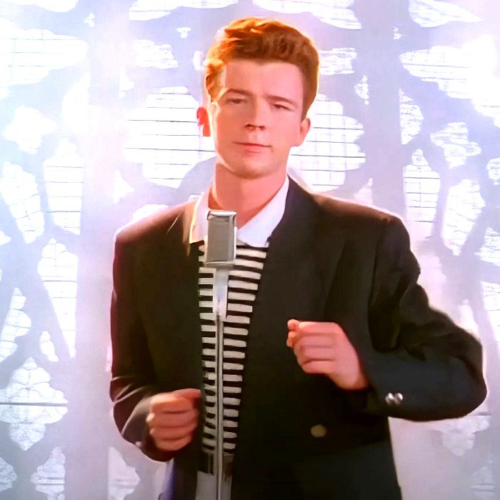

# pic2wav - Spectrogram from picture
Encode an image to sound (WAV file) and view it as a spectrogram in audio player.

# Example
`python3 pic2wav.py -d8`

Source picture:

Spectrogram of created WAV file:

## Options
    pic2wav.py [[-p] <picture>] [-w <output.wav>] [-d <seconds>] [-r <resolution>] [-e] [-i]
    Options:
      -p - input picture file (PNG, JPEG, etc.) (default is picture.png)
      -w - output WAV file (default is 'input picture file' + .wav)
      -d - output sound file duration in seconds (float) (default is 2)
      -r - spectrogram resolution; influences work time (default is 256)
      -e - equalize image (enhances contrast)
      -i - invert image colors

## Optimisation
The code is optimized for pefromance in Python 3 with math and Pillow (PIL) libraries.

I recommend running it under [PyPy](https://www.pypy.org/) -- this gives about 30% speedup.

## Thanks
* Based on [alexadam's img-encode](https://github.com/alexadam/img-encode/tree/master/v1-python) (MIT license)
